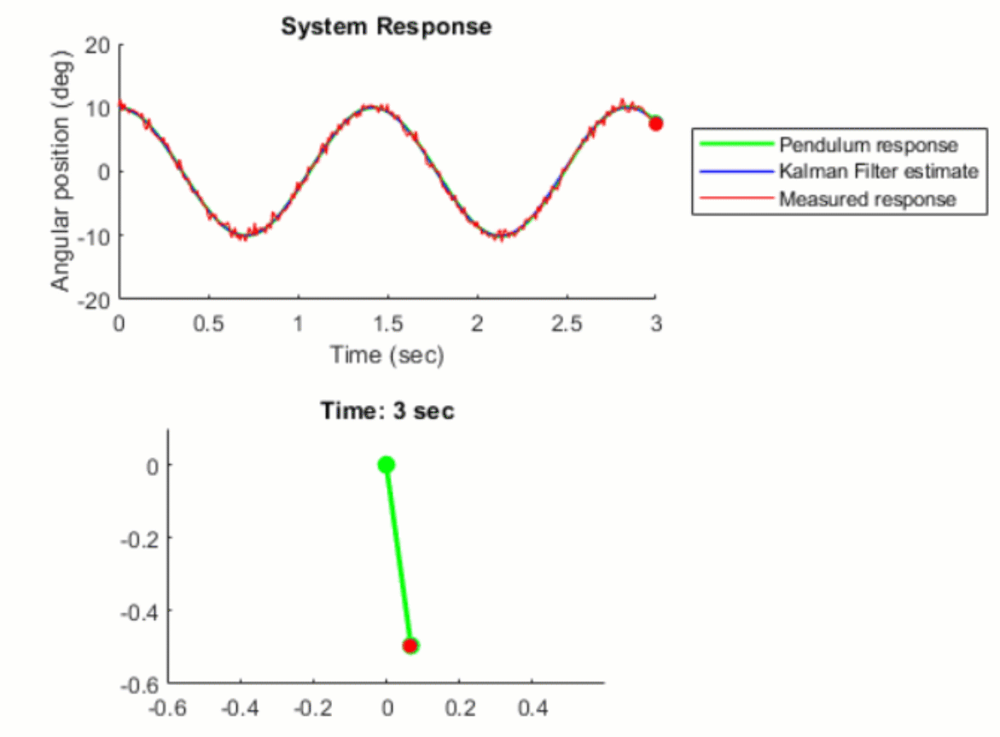

# Kalman Filter Virtual Lab

The Kalman Filter virtual laboratory contains interactive exercises that let you study linear and extended Kalman filter design for state estimation of a simple pendulum system. The virtual lab lets you visulize pendulum dynamics using 3D simulations and animations (see below).

The lab solutions are available upon instructor request. If you would like to request solutions, find an issue, or have a suggestion, contact us [here](mailto:mulusoy@mathworks.com).

![]

## Learning Goals
- Simulate a simple pendulum and visualize its swing motion
- Simulate sensor meaurement and compare measured to actual pendulum response 
- Design a Kalman Filter to estimate the angular position of the pendulum
- Design an Extended Kalman Filter to estimate the angular position of the nonlinear pendulum system

# Setup
To get started with the Kalman filter virtual lab, double-click the project.prj file inside MATLAB®. This will set up the parameters required for simulating the pendulum system and open up a live script, where you'll find the instructions for running the interactive exercises to complete the virtual lab.

# Suggested Prework
- [Kalman Filter Tech Talks](https://www.youtube.com/watch?v=mwn8xhgNpFY&list=PLn8PRpmsu08pzi6EMiYnR-076Mh-q3tWr) help students gain insights into why engineers use Kalman filters, how Kalman filter state estimation algorithm works and the different types of optimal state estimators such as extended, unscented Kalman filters and particle filters.
- [MATLAB Onramp](https://www.mathworks.com/learn/tutorials/matlab-onramp.html) – a free two-hour introductory tutorial that teaches the essentials of MATLAB.
- [Simulink Onramp](https://www.mathworks.com/learn/tutorials/simulink-onramp.html) – a free three-hour introductory tutorial that teaches the essentials of Simulink.

# Products
MATLAB, Simulink, Control System Toolbox™, Simscape™, Simscape Multibody™

# Educator Resources
- [Controls courseware](https://www.mathworks.com/academia/courseware/teaching-controls-with-matlab-and-simulink.html)
- [Teaching Modeling and Controls using MATLAB Live Scripts](https://www.mathworks.com/videos/teaching-modeling-and-controls-with-the-matlab-live-editor-1623992486476.html?s_tid=srchtitle_teaching%20modeling%20and%20controls_1)
- [Virtual Labs and Projects with MATLAB and Simulink](https://www.mathworks.com/academia/online-teaching/virtual-labs.html)

The lab solutions are available upon instructor request. Contact us [here](mailto:mulusoy@mathworks.com) if you would like to request solutions or have a question about the lab.

*Copyright 2022 The MathWorks, Inc.*
